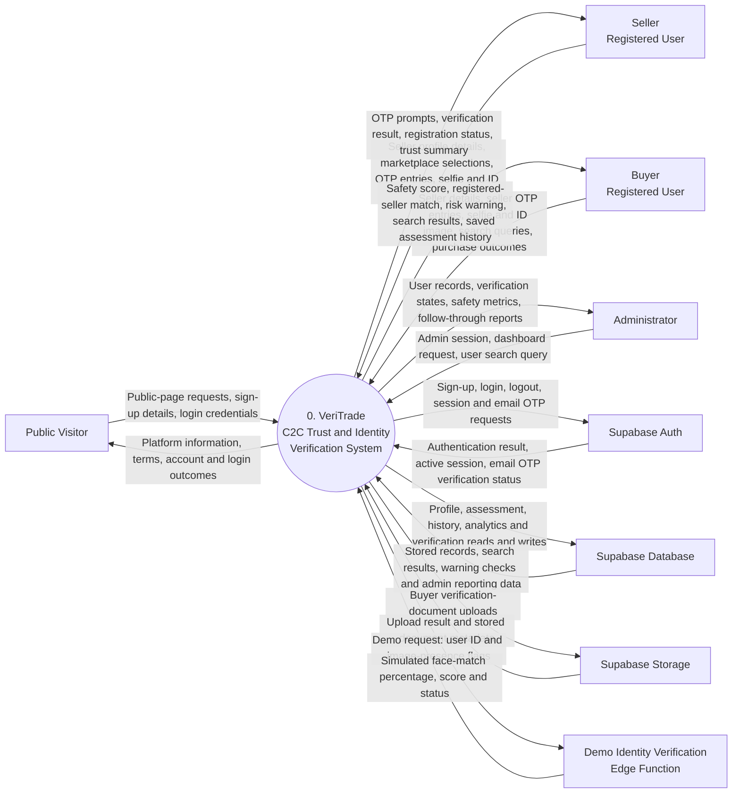

# VeriTrade Context Diagram

## Purpose

This Level 0 context diagram presents VeriTrade as one system and shows the external
people and services that exchange data with it. Buyers and sellers are shown as separate
actors because they perform different actions, although the same registered account can
use both workspaces.

## System Context

## External Interaction Summary

| External entity | Data sent to VeriTrade | Data received from VeriTrade |
| --- | --- | --- |
| **Public Visitor** | Public-page requests, account-registration details, login credentials | Public information, terms, account-creation result, login outcome |
| **Seller** | Contact details, marketplace selections, OTP entries, selfie and ID image | OTP prompts, identity result, seller-registration status, trust summary |
| **Buyer** | Seller-assessment details, OTP entries, identity images, search requests, post-purchase outcome | Safety score, seller match, risk warning, search results, saved seller-record history |
| **Administrator** | Authenticated dashboard request and user search input | Platform statistics, user verification data, buyer assessments, follow-through metrics |
| **Supabase Auth** | Authentication and email OTP outcomes | Sign-up, login, logout, session and email OTP requests |
| **Supabase Database** | Stored records and query results | Profile, assessment, history, analytics and verification reads and writes |
| **Supabase Storage** | Upload result and document metadata | Buyer verification-document uploads |
| **Demo Identity Verification Edge Function** | Simulated match score and status | User ID and flags indicating whether ID and selfie images are present |

## Boundary Notes

- VeriTrade does not currently connect directly to C2C marketplace or social-platform
  APIs. Buyers and sellers manually enter marketplace names, handles, and profile links.
- Email OTP requests use Supabase Auth. Phone OTP codes are currently generated and
  displayed by the browser as demo codes rather than delivered by an external SMS
  provider.
- The demo identity edge function receives image-presence flags, not the selfie and ID
  image files themselves. It returns a simulated match result.
- Supabase Database, Supabase Storage, and the edge function are shown outside the
  VeriTrade application boundary because they are hosted platform services used by the
  web client.

