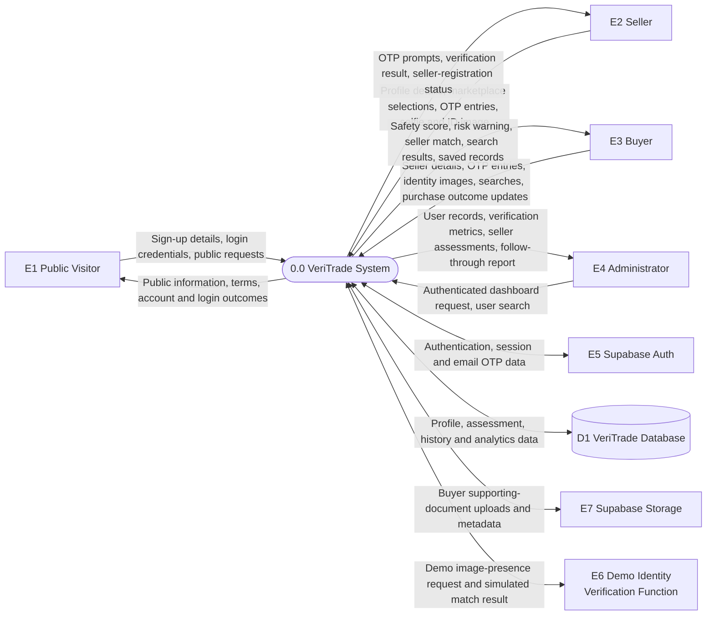
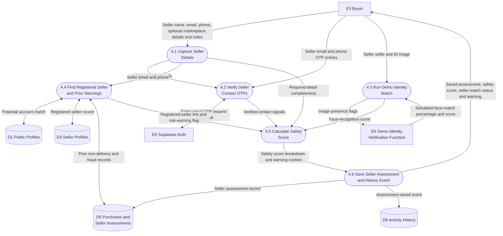

# VeriTrade Data Flow Diagram (DFD)

## Purpose

This document shows how data moves through VeriTrade. It includes:

- A **Level 0 DFD** showing the system as one process.
- A **Level 1 DFD** splitting VeriTrade into its main processes and data stores.
- A **Level 2 DFD** expanding the buyer seller-assessment workflow.

The diagrams reflect the current web client, Supabase migrations, Supabase Auth usage,
storage uploads, and demo identity-verification edge function.

## Diagram Legend

| Symbol | Meaning |
| --- | --- |
| Rectangle | External entity that exchanges data with VeriTrade |
| Rounded shape | VeriTrade process |
| Cylinder | Persistent data store |
| Arrow | Data flow |

## Level 0 DFD

## Level 1 DFD

```mermaid
flowchart TB
    VISITOR["E1 Public Visitor"]
    SELLER["E2 Seller"]
    BUYER["E3 Buyer"]
    ADMIN["E4 Administrator"]
    AUTH["E5 Supabase Auth"]
    IDENTITY["E6 Demo Identity<br/>Verification Function"]
    STORAGE["E7 Supabase Storage"]

    P1(["1.0 Manage Authentication<br/>and Public Account"])
    P2(["2.0 Maintain Buyer<br/>Profile"])
    P3(["3.0 Register and Verify<br/>Seller Profile"])
    P4(["4.0 Assess Seller<br/>Safety"])
    P5(["5.0 Manage Purchase<br/>Follow-up"])
    P6(["6.0 Search User<br/>Profiles"])
    P7(["7.0 Build User Workspace<br/>and Analytics"])
    P8(["8.0 Monitor Platform<br/>Administration"])

    D1[("D1 Public Profiles")]
    D2[("D2 Buyer Profiles")]
    D3[("D3 Seller Profiles")]
    D4[("D4 Seller Identity<br/>Verification Results")]
    D5[("D5 Purchases and<br/>Seller Assessments")]
    D6[("D6 Activity History")]
    D7[("D7 Analytics Snapshots")]
    D8[("D8 Historical<br/>Verification Checks")]

    VISITOR -->|"Registration details and login credentials"| P1
    P1 -->|"Account and login outcome"| VISITOR
    SELLER -->|"Login credentials and session requests"| P1
    BUYER -->|"Login credentials and session requests"| P1
    ADMIN -->|"Login credentials and admin session"| P1
    P1 <-->|"Sign-up, login, logout and session data"| AUTH
    P1 -->|"Create or update public account profile"| D1

    BUYER -->|"Buyer profile details and supporting documents"| P2
    P2 -->|"Buyer profile status and trust score"| BUYER
    P2 <-->|"Buyer profile data"| D2
    P2 -->|"Upload supporting documents"| STORAGE
    STORAGE -->|"Stored document metadata"| P2
    P2 -->|"Public profile updates"| D1

    SELLER -->|"Contact details, marketplace selections, OTP entries, selfie and ID image"| P3
    P3 -->|"Email OTP request and verification"| AUTH
    AUTH -->|"Email OTP status"| P3
    P3 -->|"Image-presence flags"| IDENTITY
    IDENTITY -->|"Simulated identity-match result"| P3
    P3 -->|"Seller-registration status and trust summary"| SELLER
    P3 -->|"Public profile updates"| D1
    P3 -->|"Seller profile record"| D3
    P3 -->|"Latest seller identity result"| D4
    P3 -->|"Seller profile event"| D6

    BUYER -->|"Seller details, seller OTP entries, selfie and ID image"| P4
    P4 -->|"Seller email OTP request and verification"| AUTH
    AUTH -->|"Seller email OTP status"| P4
    P4 -->|"Image-presence flags"| IDENTITY
    IDENTITY -->|"Simulated identity-match result"| P4
    P4 <-->|"Registered seller match data"| D1
    P4 <-->|"Registered seller profile data"| D3
    P4 -->|"Saved seller assessment"| D5
    D5 -->|"Prior non-delivery or fraud records"| P4
    P4 -->|"Assessment event"| D6
    P4 -->|"Safety score, seller match and risk warning"| BUYER

    BUYER -->|"Delivery, non-delivery or fraud outcome"| P5
    P5 <-->|"Purchase and follow-up record"| D5
    P5 -->|"Follow-up event"| D6
    P5 -->|"Updated outcome confirmation"| BUYER

    BUYER -->|"Name, username, email or phone query"| P6
    P6 <-->|"Searchable profile data"| D1
    P6 -->|"Matching user summaries"| BUYER

    BUYER -->|"Workspace request"| P7
    SELLER -->|"Workspace request"| P7
    P7 <-->|"Profile data"| D1
    P7 <-->|"Seller profile data"| D3
    P7 <-->|"Purchase records"| D5
    P7 <-->|"Recent events"| D6
    P7 <-->|"Historical trust-check data"| D8
    P7 -->|"Latest analytics snapshot"| D7
    P7 -->|"Account details, activity history and analytics"| BUYER
    P7 -->|"Account details, activity history and analytics"| SELLER

    ADMIN -->|"Dashboard request and user search"| P8
    P8 <-->|"Public profile data"| D1
    P8 <-->|"Buyer profile data"| D2
    P8 <-->|"Seller profile data"| D3
    P8 <-->|"Purchase assessments and outcomes"| D5
    P8 <-->|"Analytics snapshots"| D7
    P8 -->|"Platform summary, user details and follow-through metrics"| ADMIN
```

## Level 2 DFD: Assess Seller Safety

This diagram expands **Process 4.0 Assess Seller Safety**, the core buyer workflow.

## Data Store Summary

| Store | Main data held | Implementation |
| --- | --- | --- |
| `D1 Public Profiles` | Searchable account identity, username, contact details, linked marketplaces | `public.profiles` |
| `D2 Buyer Profiles` | Buyer details, platform references, behaviour flags, trust score, verification status | `public.buyer_profiles` |
| `D3 Seller Profiles` | Seller contact details, platforms, verification status, trust and confidence scores | `public.seller_profiles` |
| `D4 Seller Identity Verification Results` | Latest seller ID-selfie match result | `public.seller_identity_verifications` |
| `D5 Purchases and Seller Assessments` | Seller assessment inputs, score breakdown, seller link, follow-up outcome, fraud flag | `public.purchases` |
| `D6 Activity History` | Profile, verification and follow-up events | `public.user_history` |
| `D7 Analytics Snapshots` | Trust checks, sellers monitored, profile completion and trend metrics | `public.user_analytics` |
| `D8 Historical Verification Checks` | Historical trust-check records used by workspace analytics | `public.verification_checks` |

Buyer supporting-document files are stored in Supabase Storage. Their metadata is held
inside `D2 Buyer Profiles` in the `verification_documents` JSON attribute rather than in
a separate relational table.

## Process Summary

| Process | Responsibility |
| --- | --- |
| `1.0 Manage Authentication and Public Account` | Registers users, authenticates sessions, signs users out, and synchronizes public profiles. |
| `2.0 Maintain Buyer Profile` | Saves buyer identity details, uploads supporting documents, and calculates buyer-profile trust status. |
| `3.0 Register and Verify Seller Profile` | Confirms seller contact details, runs demo identity matching, and stores seller-registration results. |
| `4.0 Assess Seller Safety` | Captures seller evidence, verifies OTP signals, calculates a buyer-facing score, checks risk history, and saves the assessment. |
| `5.0 Manage Purchase Follow-up` | Records delivered, not-delivered, or fraud-reported outcomes against saved seller assessments. |
| `6.0 Search User Profiles` | Returns limited registered-user details for name, username, email, or phone searches. |
| `7.0 Build User Workspace and Analytics` | Aggregates profile, assessment, history, and trust-check data into the user workspace and latest analytics snapshot. |
| `8.0 Monitor Platform Administration` | Provides authorized administrators with user, assessment, safety, and follow-through reporting. |

## Implementation Notes

- Buyers and sellers are separate DFD actors because their data flows differ, but one
  authenticated account can use both roles.
- Email OTP flows use Supabase Auth. Phone OTP flows currently use browser-generated
  demo codes and do not call an external SMS provider.
- Selfie and ID images used by the seller-safety workflow are previewed locally. The
  demo identity edge function receives flags indicating whether both images exist and
  returns a simulated result.
- The `public.profiles`, `public.user_history`, `public.user_analytics`, and
  `public.verification_checks` creation migrations are not present in this repository.
  They are included because the current application reads or writes them directly.
- VeriTrade does not exchange data with marketplace APIs. Marketplace names, social
  handles, and profile links are entered manually.
