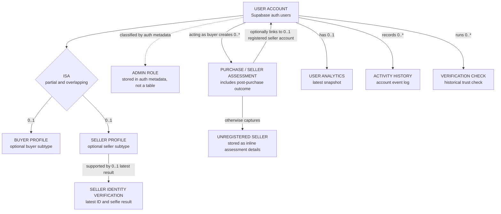
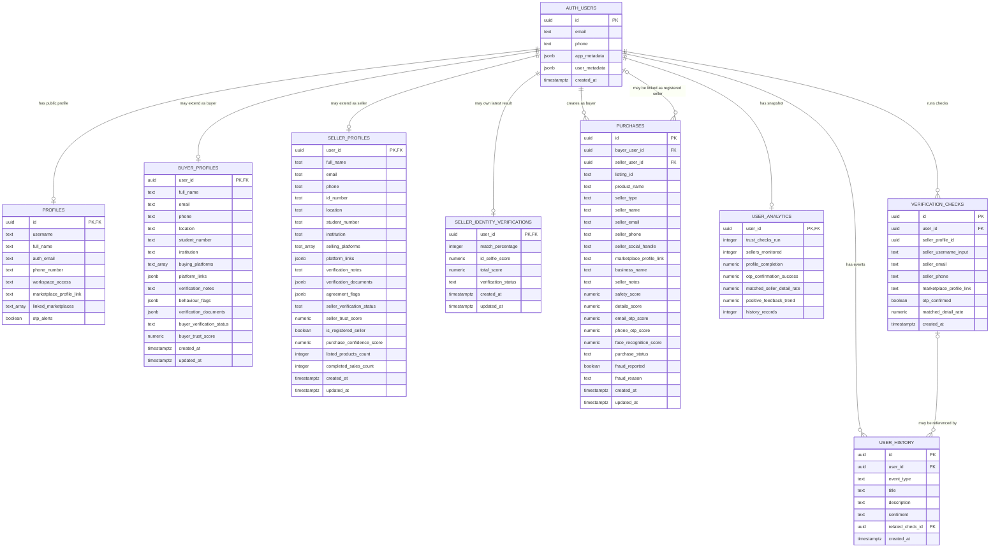

# VeriTrade Enhanced Entity Relationship Diagram (EERD)

## Scope

This EERD describes the VeriTrade data model implemented by the checked-in Supabase
migrations and the supporting tables referenced by `javascript/app.js`. VeriTrade uses
Supabase Auth as the account source of truth. A user can act as a buyer, a seller, or
both.

## Enhanced Conceptual View

The specialization is **partial** because a new account does not need a buyer or seller
profile immediately. It is **overlapping** because the same account can use both buyer
and seller workspaces.

## Logical Database EERD

## Entity Status

| Entity | Status | Source |
| --- | --- | --- |
| `auth.users` | Supabase-managed entity | Supabase Auth and foreign keys |
| `public.seller_profiles` | Confirmed table | `20260505_create_seller_profiles.sql` |
| `public.buyer_profiles` | Confirmed table | `20260520_create_buyer_profiles.sql` |
| `public.seller_identity_verifications` | Confirmed table | `20260504_seller_identity_verifications.sql` |
| `public.purchases` | Confirmed table | `20260505_create_purchases.sql` and later alterations |
| `public.profiles` | Application-referenced supporting table | Client upserts, search RPC, and admin RPC |
| `public.user_analytics` | Application-referenced supporting table | Client upserts and admin RPC |
| `public.user_history` | Application-referenced supporting table | Client inserts and workspace reads |
| `public.verification_checks` | Application-referenced supporting table | Workspace analytics reads |

The creation migrations for the application-referenced supporting tables are not present
in this repository. Their displayed attributes are limited to the columns used by the
current JavaScript and SQL.

## Cardinality Summary

| Relationship | Cardinality | Meaning |
| --- | --- | --- |
| Account to public profile | `1 : 0..1` | Each account may have one searchable public profile. |
| Account to buyer profile | `1 : 0..1` | Buyer information is an optional account specialization. |
| Account to seller profile | `1 : 0..1` | Seller information is an optional account specialization. |
| Account to identity result | `1 : 0..1` | `user_id` is the verification table primary key, so only the latest seller identity result is retained. |
| Buyer account to purchase | `1 : 0..*` | An account acting as a buyer can save many seller assessments and follow-up records. |
| Registered seller account to purchase | `0..1 : 0..*` | A purchase optionally links to a registered seller. Unregistered seller details remain inline in `purchases`. |
| Account to analytics snapshot | `1 : 0..1` | The workspace maintains one latest analytics summary per account. |
| Account to history entry | `1 : 0..*` | An account can accumulate many activity events. |
| Account to verification check | `1 : 0..*` | An account can run multiple trust checks. |

## Enhanced Model Notes

- `BUYER_PROFILES` and `SELLER_PROFILES` are optional, overlapping subtypes of
  `AUTH_USERS`.
- `PURCHASES` acts as both a seller-assessment record and a post-purchase follow-up
  record. Its seller link is optional because VeriTrade supports assessments of
  unregistered sellers.
- `selling_platforms`, `buying_platforms`, `platform_links`, `behaviour_flags`,
  `verification_documents`, and `agreement_flags` are multivalued or composite
  attributes stored as arrays or JSON.
- Admin access is a role derived from authentication metadata. It is not a separate
  database entity.
- Follow-through percentage, average safety score, sellers monitored, and prior seller
  risk warnings are derived values calculated from stored purchase and analytics data.
- The seller registration form currently requires street, city, province, and postal
  code inputs, but the current persistence payload does not save those individual
  values. They are therefore not shown as stored `SELLER_PROFILES` attributes.

