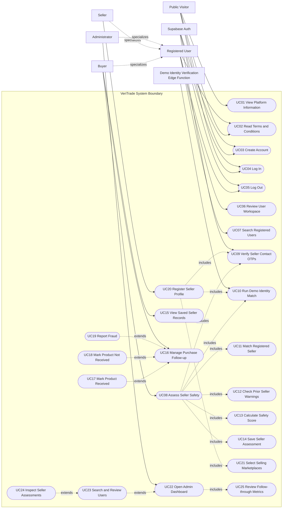

# VeriTrade Use Case Diagram

## Purpose

This use case diagram shows how people and hosted services interact with VeriTrade.
Buyer, Seller, and Administrator are modeled as specialized registered-user roles. A
single account can use both the Buyer and Seller roles.

## System Use Case Diagram

## Actor Summary

| Actor | Description | Main use cases |
| --- | --- | --- |
| **Public Visitor** | A person who has not entered an authenticated workspace. | View platform information, read terms, create an account, log in |
| **Registered User** | The common authenticated account role inherited by buyers, sellers, and administrators. | Log out, review the user workspace, search registered users |
| **Buyer** | A registered user assessing sellers and recording purchase outcomes. | Assess seller safety, view saved seller records, manage follow-up |
| **Seller** | A registered user creating a trusted seller presence. | Register seller profile, verify contact OTPs, run demo identity match, select marketplaces |
| **Administrator** | A registered user with an admin role in authentication metadata. | Open admin dashboard, search and review users, inspect assessments, review follow-through |
| **Supabase Auth** | Hosted authentication and email OTP service. | Create account, log in, log out, verify seller contact OTPs |
| **Demo Identity Verification Edge Function** | Hosted demo service that returns a simulated face-match result. | Run demo identity match |

## Use Case Summary

| ID | Use case | Primary actor | Outcome |
| --- | --- | --- | --- |
| `UC01` | View Platform Information | Public Visitor | The visitor learns how VeriTrade supports safer C2C trades. |
| `UC03` | Create Account | Public Visitor | A VeriTrade account is created. Its public profile is synchronized after authenticated portal entry. |
| `UC04` | Log In | Public Visitor | The user enters an authenticated workspace. |
| `UC06` | Review User Workspace | Registered User | The user sees account details, analytics, history, and saved records. |
| `UC07` | Search Registered Users | Registered User | Limited profile matches are returned for a name, username, email, or phone search. |
| `UC08` | Assess Seller Safety | Buyer | A privacy-conscious seller assessment, score breakdown, match result, and risk context are saved. |
| `UC15` | View Saved Seller Records | Buyer | Previously assessed sellers and their post-purchase states are displayed. |
| `UC16` | Manage Purchase Follow-up | Buyer | A seller assessment is updated with a delivered, not-delivered, or fraud-reported outcome. |
| `UC20` | Register Seller Profile | Seller | A seller profile is saved with marketplaces, OTP checks, identity result, and trust status. |
| `UC22` | Open Admin Dashboard | Administrator | Authorized platform-wide account and follow-through reporting is displayed. |

## Relationship Notes

| Relationship | Meaning in VeriTrade |
| --- | --- |
| `Buyer`, `Seller`, and `Administrator` specialize `Registered User` | These actors inherit common authenticated actions. One account can use more than one role. |
| `Create Account` and `Log In` are separate | Sign-up sometimes creates a session immediately. When email confirmation is required, the user verifies the account before entering the workspace. |
| `Assess Seller Safety` includes OTP, identity, matching, warning, scoring, and saving use cases | These steps form the buyer-side seller-assessment workflow. |
| `Register Seller Profile` includes OTP checks, identity matching, and marketplace selection | Seller submission is enabled only after the required registration evidence is ready. |
| `Manage Purchase Follow-up` is extended by the three outcome actions | The buyer chooses one follow-up result for a saved seller assessment. |
| `Open Admin Dashboard` includes follow-through metrics | The dashboard loads operational statistics when an authorized admin opens it. |
| Admin user search and assessment inspection extend the dashboard | An administrator can optionally search for a user and drill into saved seller assessments. |

## Implementation Notes

- Supabase Database is not drawn as a use case actor. Database persistence supports the
  use cases internally but does not pursue a user goal.
- Email OTP requests use Supabase Auth. Phone OTPs currently use browser-generated demo
  codes, so an SMS provider is not shown as an actor.
- Seller and buyer identity checks call the demo edge function with image-presence flags
  and receive a simulated score. The image files themselves are not sent to that
  function.
- The JavaScript contains a dormant buyer-profile handler, but the current Buyer page
  exposes the seller-assessment form rather than a buyer-profile maintenance form. The
  inactive handler is therefore not modeled as a user-facing use case.
- VeriTrade does not currently call marketplace APIs. Marketplace names, handles, and
  profile links are entered manually.
